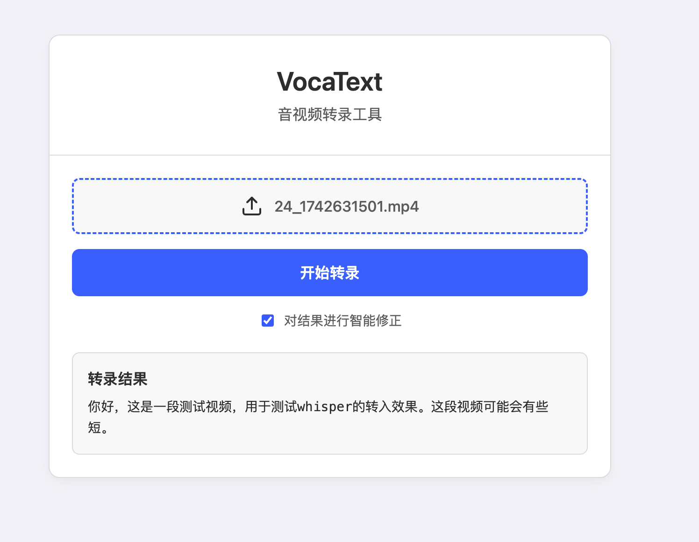

# VocaText - 智能音视频转录工具



VocaText 是一个现代化的、容器化的音视频转录Web应用。它利用语音识别和大型语言模型技术，为用户提供快速、准确的转录服务，并能对结果进行智能校正。

---

## 📝 项目状态

**当前版本为最小可行化产品 (MVP)**

我们正在全力以赴地开发和添加新功能。如果您在使用过程中遇到任何问题，或有任何宝贵的建议，请随时通过 [GitHub Issues](<your-repository-url>/issues) 告诉我们！

---

## ✨ 功能介绍

*   **多文件格式支持**: 支持多种主流音频和视频格式 (如 .mp3, .wav, .mp4, .mov 等)。
*   **智能转录**: 调用高效的语音识别模型，将音视频内容快速转换为文字。(注：当前版本暂时只支持调用硅基流动平台的识别模型，后续会追加更多识别方式。)
*   **AI 文本校正**: 可选开启 AI 智能修正功能，利用大型语言模型对转录结果进行润色，修正错别字和语病，提升文本质量。
*   **前后端分离**: 采用现代化的前后端分离架构，界面响应迅速，体验流畅。
*   **容器化部署**: 整个应用被封装在 Docker 容器中，实现一键启动，轻松部署，跨平台兼容。
*   **安全配置**: API 密钥等敏感信息通过环境变量进行管理，保障了代码和配置的安全性。

## 🛠️ 技术栈

*   **前端**: Vue.js 3 (Composition API)
*   **后端**: Python 3.12 + FastAPI
*   **音频处理**: Pydub
*   **部署**: Docker & Docker Compose
*   **核心 API**: SiliconFlow (用于语音识别和 LLM 校正)

## 🚀 如何运行

本项目已完全容器化，您只需要安装 [Docker](https://www.docker.com/products/docker-desktop/) 即可轻松运行。

1.  **克隆项目**
    ```bash
    git clone <your-repository-url>
    cd VocaText
    ```

2.  **配置密钥**
    将 `.env.example` 文件复制为 `.env`，并填入您自己的 API 密钥。
    ```bash
    cp .env.example .env
    ```
    然后编辑 `.env` 文件：
    ```
    SILICON_FLOW_API_KEY=your_silicon_flow_api_key_here
    LLM_API_KEY=your_llm_api_key_here
    ```

3.  **启动应用**
    使用 Docker Compose 一键构建并启动应用：
    ```bash
    docker-compose up --build
    ```
    首次构建可能需要几分钟。构建成功后，服务将在后台运行。

4.  **访问应用**
    在您的浏览器中打开 **http://localhost:8001** 即可开始使用。

## 🗺️ 未来规划

为了让 VocaText 变得更强大和实用，我们规划了以下功能：

*   **多语言支持**:
    *   增加对英语、日语等多种主流语言的转录支持。
*   **说话人识别 (Diarization)**:
    *   在转录结果中区分不同的说话人，并进行标记（如：`说话人 A: ...`, `说话人 B: ...`）。
*   **字幕导出功能**:
    *   支持将转录结果导出为常见的字幕格式（如 `.srt`, `.vtt`），方便视频创作者使用。
*   **历史记录与管理**:
    *   为用户提供一个历史记录页面，可以查看、编辑和删除过去的转录任务。
*   **实时转录**:
    *   支持从麦克风进行实时语音输入，并实时显示转录结果。
*   **UI/UX 优化**:
    *   持续优化用户界面，提供更直观、更美观的操作体验。
